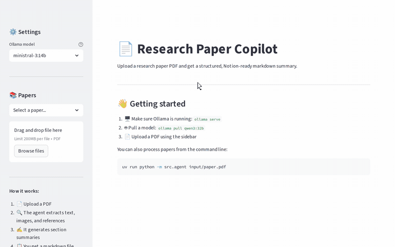

# Paper Copilot

A local AI agent that reads a research paper (PDF) and produces a structured, Notion-ready markdown summary. Built with LangChain and Ollama — all processing happens on your machine, no data leaves it.



## What it does

Drop a PDF, get a markdown summary containing:

- **Metadata** — title, authors, venue, year, DOI
- **Overview** — what the paper is about
- **Contribution** — what the authors propose and why it matters
- **State of the Art** — related work landscape
- **Methodology** — high-level overview + detailed walkthrough with formulae
- **Evaluation** — datasets, metrics, baselines
- **Key Results** — main findings as bullet points
- **References Analysis** — pie chart of venue distribution
- **Figures** — relevant images extracted from the PDF with captions

## Quickstart

### Prerequisites

- Python 3.12+
- [Ollama](https://ollama.com/) running locally
- A model that supports tool calling pulled via Ollama

### Setup

```bash
# Install uv (if not already installed)
curl -LsSf https://astral.sh/uv/install.sh | sh

# Clone and install
git clone git@github.com:MarcosRodrigoT/Paper-Copilot.git
cd Paper-Copilot
uv sync

# Pull an Ollama model
ollama pull gpt-oss
```

### Run via CLI

```bash
uv run python -m src.agent input/paper.pdf
```

### Run via web UI

```bash
uv run streamlit run app.py
```

Then open http://localhost:8501, drag-and-drop a PDF, and click **Generate Summary**.

## Architecture

```
PDF ──► extract_text ──────────────────────────────► LLM (per-section) ──► save_markdown ──► summary.md
    ├─► extract_images ──► figure selection (LLM) ─┘                       + images/
    └─► parse_references ──► generate_chart ────────────────────────────────┘
```

The pipeline uses a **hybrid approach**:
- **Code** handles deterministic steps: PDF parsing, image extraction, reference parsing, chart generation, markdown assembly
- **LLM** handles creative steps: writing each section summary individually with focused prompts and only the relevant paper text

This is more reliable than a pure ReAct agent because local models tend to stop calling tools after seeing large results.

## Configuration

Edit `src/config.py` to change the model or paths:

```python
OLLAMA_MODEL = "gpt-oss"              # Any Ollama model
OLLAMA_BASE_URL = "http://localhost:11434"
```

Good model choices for 2x RTX 4090:
- `gpt-oss` — built for structured outputs and agentic use
- `mistral-small` — best documented for function calling
- `mistral-small3.2` — improved function calling, vision capable

## Project structure

```
├── app.py                  # Streamlit web UI
├── src/
│   ├── agent.py            # Orchestration pipeline
│   ├── config.py           # Model and path settings
│   ├── prompts.py          # Per-section LLM prompts
│   └── tools/
│       ├── extract_text.py     # PDF → text sections
│       ├── extract_images.py   # PDF → image files + captions
│       ├── parse_references.py # References → structured data
│       ├── generate_chart.py   # Venue data → pie chart PNG
│       └── save_markdown.py    # Everything → final .md
├── input/                  # Drop PDFs here
├── output/                 # Generated summaries
└── docs/                   # Step-by-step explanations
```

## Documentation

The `docs/` folder contains step-by-step explanations of every component, written as a learning resource:

| Doc | Topic |
|-----|-------|
| `00-project-overview.md` | Project summary and plan |
| `01-setup.md` | uv, Ollama, and project setup |
| `02-pdf-extraction.md` | How PDF text extraction works |
| `02b-image-extraction.md` | How PDF image extraction works |
| `03-tools.md` | All five tools and how they connect |
| `04-agent.md` | The agent loop and LLM orchestration |
| `05-ui.md` | Streamlit UI integration |
